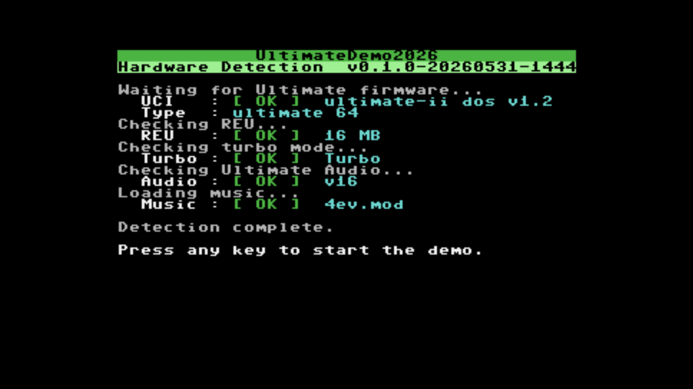
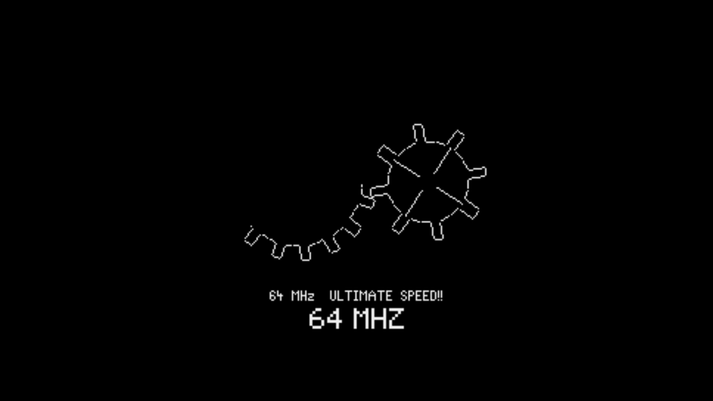
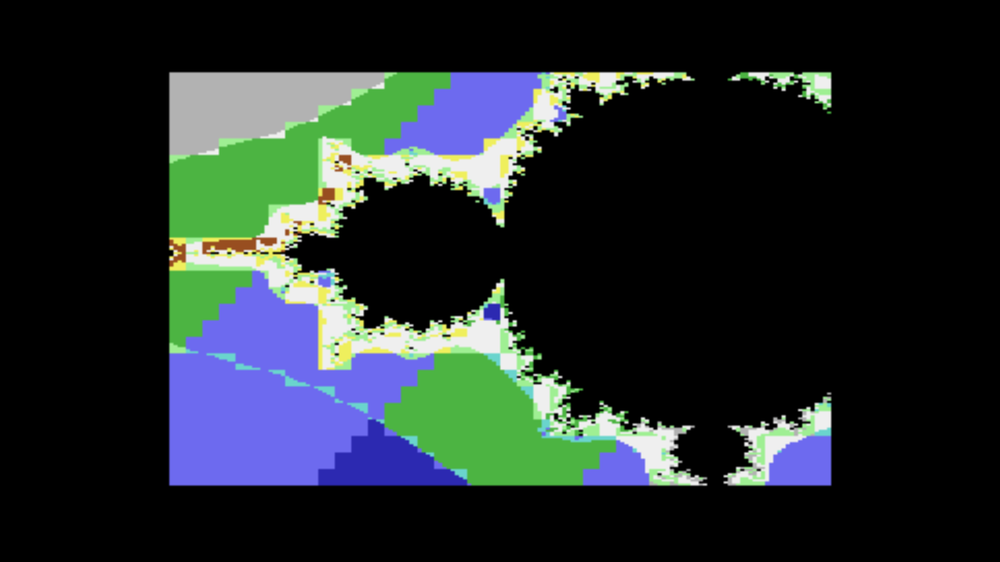
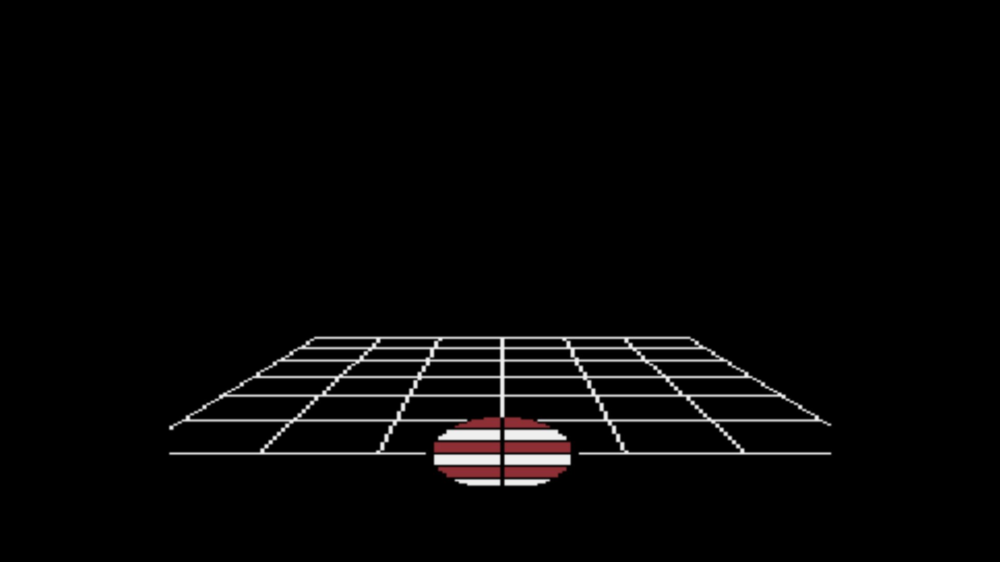
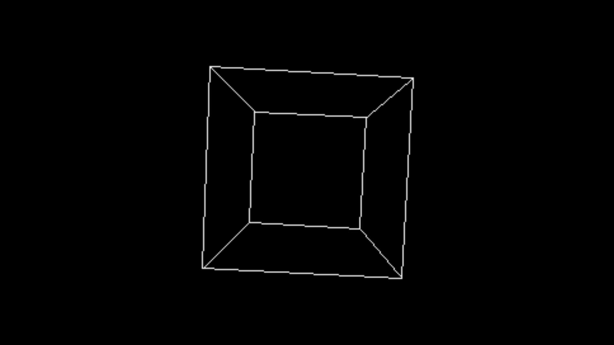
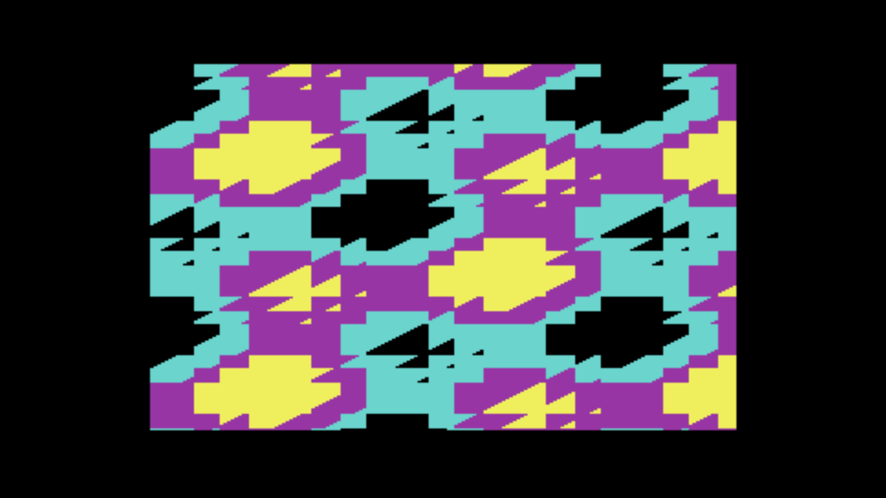
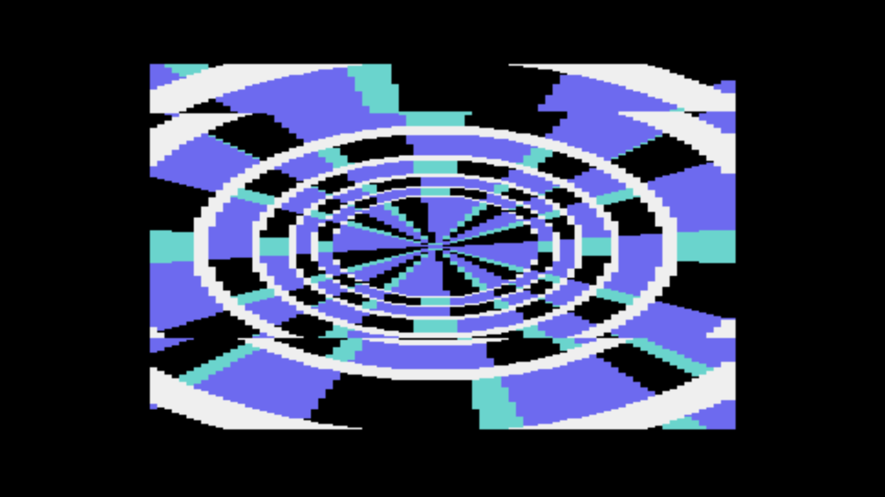
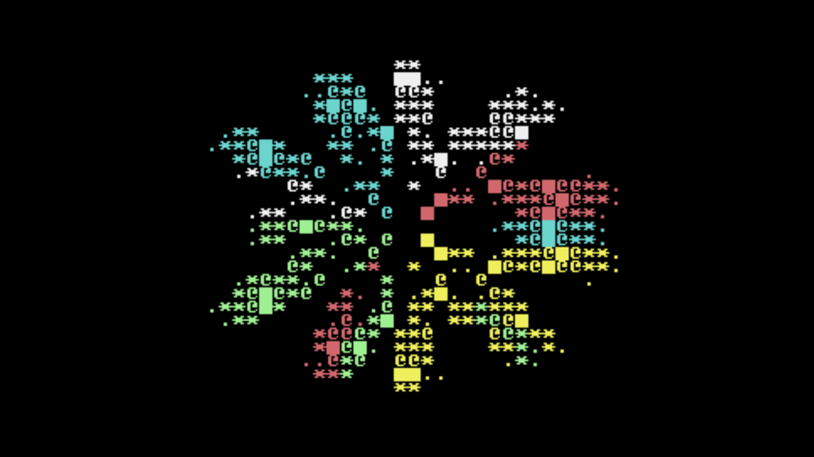
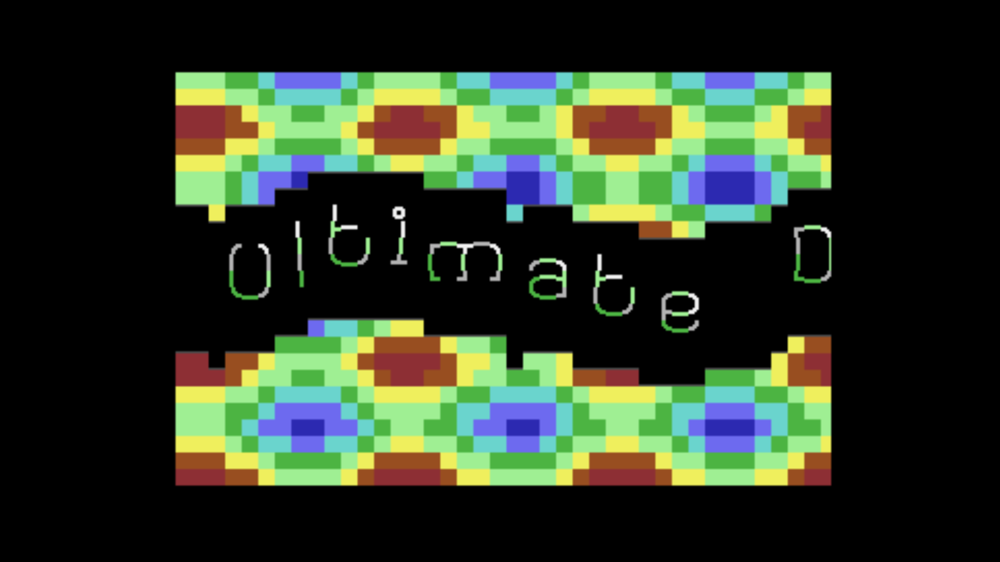

# UltimateDemo2026

A demo for the Ultimate 64, showcasing turbo mode, Ultimate Audio DMA, and
various visual effects running at 64 MHz.

**[Download latest release (v1.0.0)](https://github.com/xahmol/UltimateDemo2026/releases/download/v1.0.0/udemo2026-v1.0.0-20260531-1535.zip)**

---

## Requirements

- **Ultimate 64** (U64 or U64 Elite) with firmware configured as follows:
  - **Turbo Mode** enabled: F2 → Turbo Mode → *U64 Turbo Registers*
  - **REU** set to 16 MB: F2 → C64 settings → REU → *16 MB*
  - **Ultimate Audio** enabled: F2 → C64/Cart settings → *Audio*
- One SD card or USB drive connected with the demo files (see Installation)

---

## Installation

1. Download the ZIP from the link above (or the [releases page](https://github.com/xahmol/UltimateDemo2026/releases)).
2. Extract the ZIP to the **root** of an SD card or USB drive.
   The ZIP already contains the `idi8b/ultdemo2026/` folder — extracting at the
   drive root creates the correct directory layout automatically.
3. Insert the SD card or connect the USB drive to your Ultimate 64.
4. In the Ultimate menu, navigate to `idi8b/ultdemo2026/` and load `udemo2026.prg`.

**If you cannot extract directly to the drive root** (e.g. your unzip tool
puts files in a subfolder, or you are placing files manually):

- Create the folder `idi8b/ultdemo2026/` on the drive root.
- Copy `udemo2026.prg` and `4ev.mod` into that folder.
- The path on the drive must be exactly: `idi8b/ultdemo2026/udemo2026.prg`
  and `idi8b/ultdemo2026/4ev.mod` — the demo searches for this path on every
  connected SD card and USB drive automatically.

> **Note:** The demo auto-detects all connected SD and USB drives and locates the
> `idi8b/ultdemo2026/` folder automatically. If you have multiple drives connected,
> place the demo files on only **one** of them to avoid ambiguity.

> **Power-user tip:** Set your Ultimate home directory
> (F2 → User Interface Settings → Home Directory) to `idi8b/ultdemo2026/`.
> The demo will find its files instantly without scanning all drives.

---

## Scenes

| Scene | Description |
|-------|-------------|
| **Gears** | Speed ramp from 1 to 64 MHz with rotating XOR gear pattern |
| **Mandelbrot** | Multicolor Mandelbrot fractal zoom |
| **Ball** | 3D shaded ball with rotating wireframe floor |
| **Vectors** | 3D wireframe rotating cube |
| **Plasma** | Sine-interference plasma effect |
| **Tunnel** | Texture-mapped 3D tunnel |
| **Flower** | PETSCII polar rose (spinning rhodonea curve) |
| **Scroller** | Full-screen PETSCII font scroller with music |

---

## Screenshots

All screenshots taken on real Ultimate 64 hardware.

### Hardware Detection



The startup screen probes all required hardware — UCI (Ultimate Command Interface), 16 MB REU,
turbo mode, and the Ultimate Audio module — before loading the MOD music file and starting the demo.

---

### Scene 1 — Gears



A rotating gear pair drawn with XOR line rendering in hires bitmap mode. The CPU speed ramps from
1 MHz up to 64 MHz across 16 steps; the gear animation visibly accelerates with each step,
demonstrating the speed increase directly.

---

### Scene 2 — Mandelbrot



A full Mandelbrot set rendered in multicolor bitmap mode using per-iteration escape-count coloring.
At 1 MHz this computation would take several minutes; at 64 MHz it completes in seconds.

---

### Scene 3 — Ball



A shaded 3D ball — rendered as concentric bitmap circles with three brightness rings — bouncing
on a rotating perspective wireframe grid. The grid rotates on the Y-axis and the ball follows
a sine-curve bounce trajectory with lateral sway.

---

### Scene 4 — Vectors



A 3D wireframe cube rotating simultaneously on X and Y axes, drawn with Bresenham line rendering
in hires bitmap mode. XOR animation erases the previous frame before drawing the next,
keeping the effect crisp without a full bitmap clear each frame.

---

### Scene 5 — Plasma



A classic plasma sine-interference effect in multicolor bitmap mode. Three independently
advancing sine wave offsets are summed per pixel to index a 4-color palette (black, cyan,
purple, yellow), producing the characteristic flowing color pattern.

---

### Scene 6 — Tunnel



A real-time texture-mapped tunnel effect in multicolor mode. Per-pixel angle and distance
are precomputed into a 16 KB lookup table stored in REU and fetched row by row during
rendering. A sine-wave lateral sway animates the viewpoint, giving the impression of flying
through a curved tunnel.

---

### Scene 7 — Flower



A full-screen PETSCII animation of a spinning rhodonea (polar rose) curve. Per-cell angle and
radius are precomputed at init time; each frame the petal shape is re-evaluated using an integer
cosine lookup and colored by angle sector. Phase 1 shows a 5-petal rose in warm colors
(white, cyan, yellow, light green, light red); phase 2 switches to an 8-petal shape in cool colors.

---

### Scene 8 — Scroller



A hardware fine-scroll sinus scroller using the Cupid PETSCII bitmap font. Characters scroll
smoothly left using the $D016 fine-scroll register; each column is displaced vertically by a
sine table to create the wave. A full-color plasma effect fills the background.

---

### End Screen

![End screen listing all scenes as completed with [ OK ] marks](screenshots/10_endscreen.png)

After all scenes complete, a summary screen lists every effect with its description.
Press any key to return cleanly to BASIC.

---

## Memory Map

Runtime layout for the compiled binary (Oscar64, VIC bank 0, `$01=$36` — KERNAL + I/O visible, BASIC ROM removed).

### Program sections

| Range | Size | Contents |
|-------|------|----------|
| `$0801–$0852` | 82 B | Oscar64 BASIC bootstrap (`SYS 2560`) |
| `$00F7–$00FA` | 4 B | Zero-page scratch (turbo benchmark loop) |
| `$0400–$07FF` | 1 KB | Text screen RAM (VIC bank 0, 40×25 chars) |
| `$0A00–$8080` | ~31 KB | Code section |
| `$8081–$97C7` | ~6 KB | Data section (const tables, font arrays, lookup tables) |
| `$97C8–$ABA0` | ~5 KB | BSS section (UCI buffers, modplay state, scene locals) |
| `$ABA0–$AFFF` | ~1.4 KB | Oscar64 heap |
| `$B000–$BFFF` | ~4 KB | Oscar64 C software stack |

### I/O region (`$D000–$DFFF` at `$01=$36`)

| Address | Device |
|---------|--------|
| `$D000–$D3FF` | VIC-II registers |
| `$D400–$D7FF` | SID registers |
| `$D800–$DBFF` | Color RAM (1 KB, 40×25 cells) |
| `$DC00–$DCFF` | CIA 1 (keyboard matrix; Timer A drives MOD BPM IRQ) |
| `$DD00–$DDFF` | CIA 2 (serial bus; port A controls VIC bank) |
| `$DF00–$DF1F` | REU registers |
| `$DF20–$DFFF` | Ultimate Audio channels 1–7 |

### Scene-specific overlapping regions

| Range | Size | Used by |
|-------|------|---------|
| `$C000–$CFFF` | 4 KB | MC screen RAM (mandel, plasma scenes) |
| `$C000–$C7CF` | 2 KB | Flower precomputed angle/radius tables (flower scene only) |
| `$E000–$FFFF` | 8 KB | Hires / MC bitmap (gears, mandel, ball, vectors, plasma) |
| `$E000–$FFFF` | 8 KB | KERNAL ROM (visible when no bitmap scene is active) |

### Patches applied at startup

| Address | Value | Reason |
|---------|-------|--------|
| `$0310` | `$60` (RTS) | Stub target for KERNAL UDTIM hook redirects |
| `$A002:$A003` | `$10 $03` | Redirects KERNAL `JMP ($A002)` to RTS stub at `$0310` — prevents KERNAL IRQ chain from calling BASIC ROM code at its old address (which is now DRAM, not BASIC ROM) |

### REU (16 MB, `$000000–$FFFFFF`)

| Range | Contents |
|-------|----------|
| `$000000+` | `4ev.mod` ProTracker music loaded at startup via UCI |

---

## Credits

- **Code:** Xander Mol
- **Music:** *4ev.mod* (Forever Young)
- **UCI/DOS library:** Scott Hutter & Francesco Sblendorio
- **MOD player:** based on ModPlayer_16k by 6510nl / Freshness
- **Font:** Small Round PETSCII Font by Cupid
- **Compiler:** Oscar64 by drmortalwombat

---

## Building from source

Requirements: [Oscar64](https://github.com/drmortalwombat/oscar64), `zip`, `wput`, `curl`.

```
make          # compile → build/udemo2026.prg + versioned ZIP in build/
make clean    # remove build artefacts
make deploy   # upload PRG + MOD to Ultimate 64 via FTP
```

Create a `.env` file in the project root with your Ultimate 64's IP address (copy from `.env.example`):

```
ULTHOST = 192.168.1.x
```

`.env` is listed in `.gitignore` and will not be committed.
The `make deploy` target checks connectivity before uploading and prints a
friendly error if the device is unreachable.
