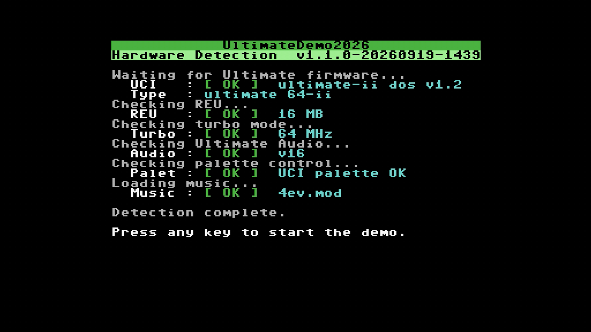
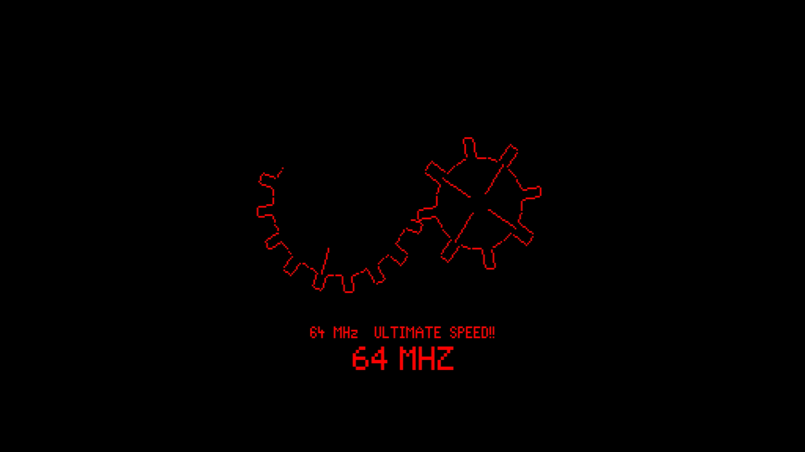
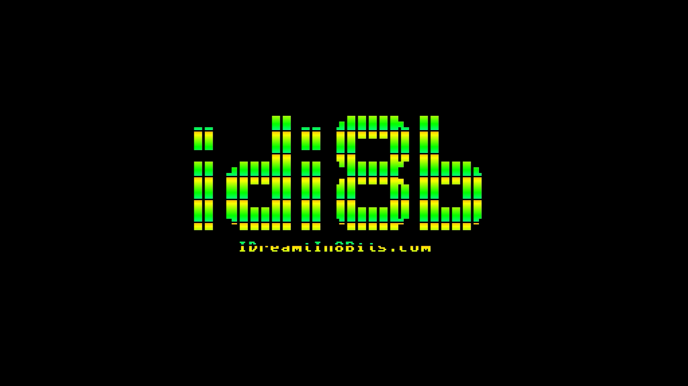
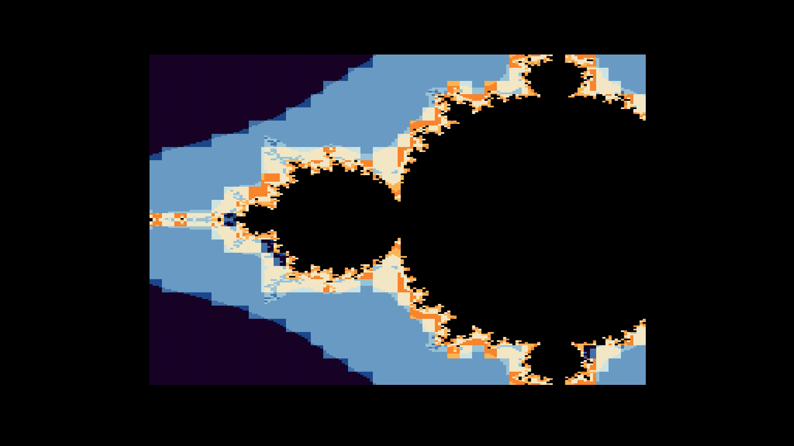
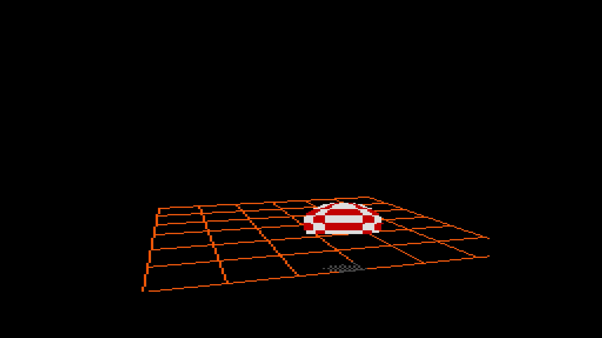
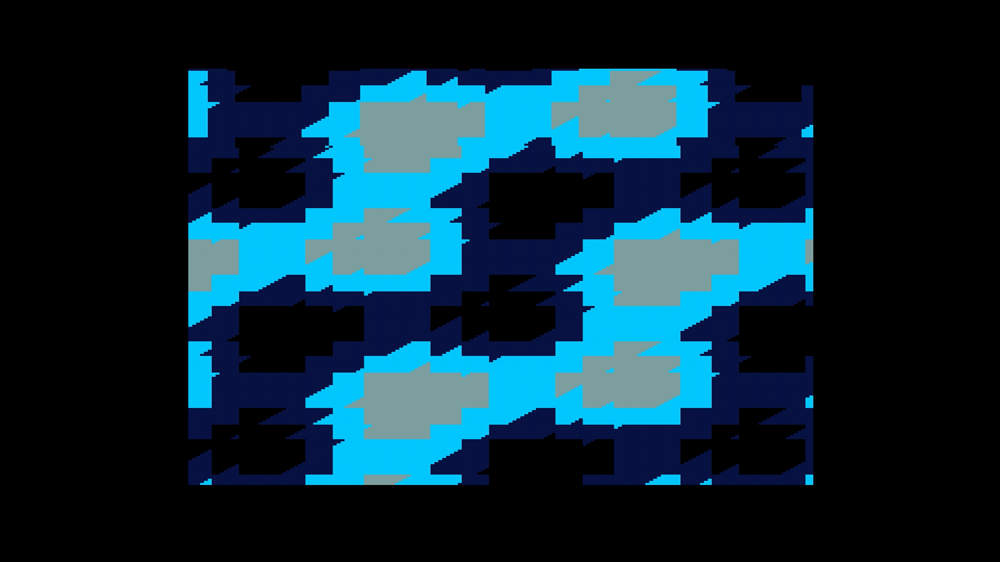
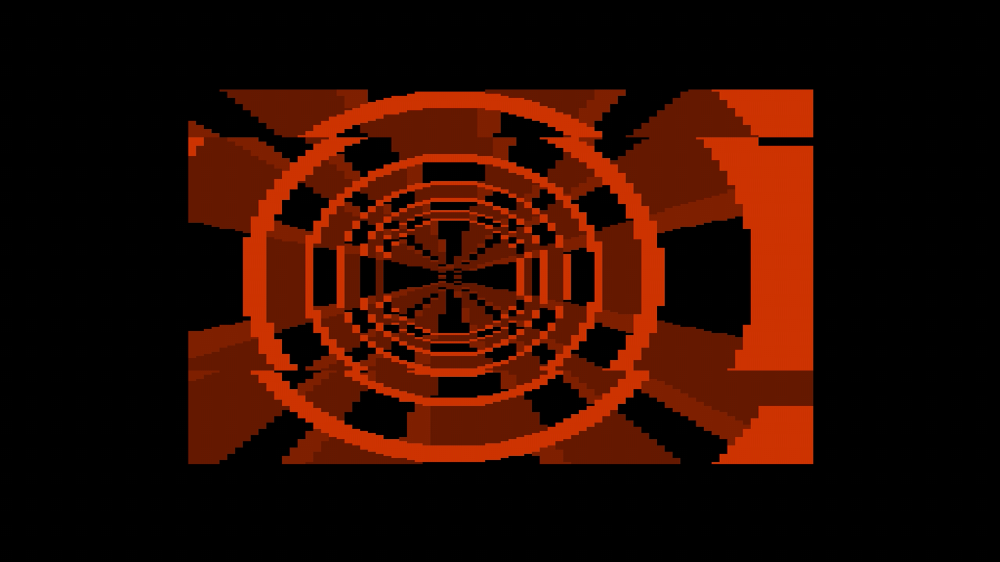
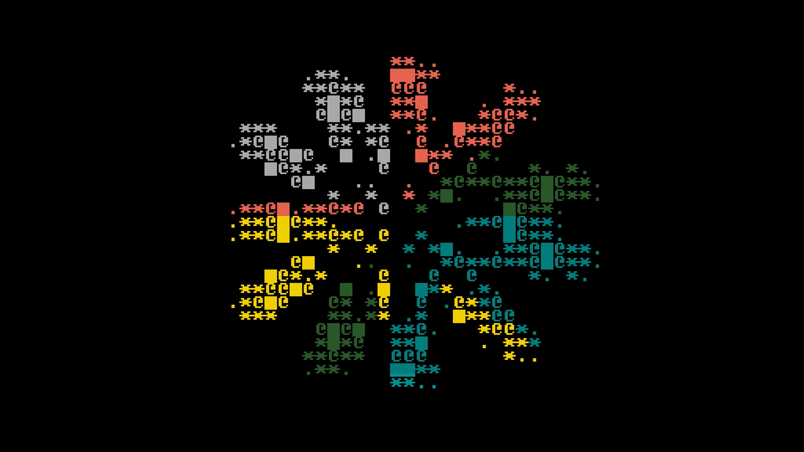
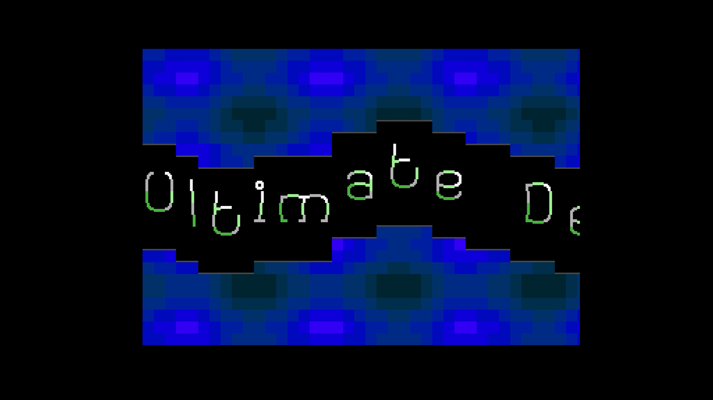

# UltimateDemo2026

A demo for the Ultimate 64, showcasing turbo mode, Ultimate Audio DMA, and
various visual effects running at 64 MHz.

**[Download latest release (v1.1.1)](https://github.com/xahmol/UltimateDemo2026/releases/tag/v1.1.1)** —
**[Watch on YouTube](https://www.youtube.com/watch?v=R44cU_9DcUE)**

---

## Contents

1. [Release history](#release-history)
2. [Requirements](#requirements)
3. [Installation](#installation)
4. [Scenes](#scenes)
5. [Screenshots](#screenshots)
6. [Memory Map](#memory-map)
7. [Credits](#credits)
8. [Building from source](#building-from-source)
9. [Reusing the libraries in your own project](#reusing-the-libraries-in-your-own-project)
   - [Turbo speed control](#turbo-speed-control)
   - [Ultimate Audio DMA](#ultimate-audio-dma)
   - [ProTracker MOD player](#protracker-mod-player)
   - [Ultimate Command Interface (UCI)](#ultimate-command-interface-uci)

---

## Release history

**[Download latest release (v1.1.1)](https://github.com/xahmol/UltimateDemo2026/releases/tag/v1.1.1)**

### v1.1.1 — 2026-09-23

**Improvements:**

- `turbo_detect()`'s timing loop rewritten from a deliberately-unoptimised C loop to a short,
  hand-written 6502 assembly loop with a fixed, precisely computable cycle cost per iteration —
  far less run-to-run timing jitter than compiler-generated code, needing far less safety margin
  around the detection threshold.

**Fixes:**

- Fixed an intermittent false "Turbo: Not detected" result at startup. `turbo_detect()` jumped
  directly from whatever speed an auto-loaded `.cfg`'s own Turbo Control setting had already put
  the hardware in to maximum speed — an unclean transition that could fail to settle. It now
  forces a clean 1 MHz baseline, with its own settle pass, before transitioning to max.
- Fixed a MHz-classification bug where a genuine 64 MHz-capable Ultimate 64-II or Commodore 64
  Ultimate (C64U) could be mislabeled "48 MHz" on the detection screen. The bare `"Ultimate 64"`
  hardware-identity string is ambiguous — both a C64U and the original, rarer, genuinely 48 MHz
  non-Elite Ultimate 64 report it identically — and the old logic defaulted that ambiguous case to
  48 MHz. It now only reports 48 MHz for the distinct, unambiguous `"Ultimate 64 Elite"` string, and
  defaults everything else — including the ambiguous bare string — to 64 MHz. The only hardware this
  can still mislabel is a genuine original non-Elite Ultimate 64, an accepted tradeoff since it's by
  far the rarer case today.
- Fixed a persistent one-pixel artifact at the left screen edge during the scroller's horizontal
  fine-scrolling. The scroller's own screen-mode setup unconditionally resets the display to
  standard 40-column mode; the fix narrows it to 38 columns instead, tucking the artifact behind
  the border, and restores 40-column mode afterward for the end screen.

### v1.1.0 — 2026-09-20

**[Watch on YouTube](https://www.youtube.com/watch?v=R44cU_9DcUE)**

**New scene: Palette Morph.** A firmware 3.15+ UCI palette showcase — the idi8b studio logo
rendered with true per-scanline raster-bar ink colour (swept via `$D021` under UCI palette
control, not just a per-character-row colour), placed right after the Gears intro. Skipped
entirely (no fallback) on pre-3.15 firmware, since the whole point is showing off RGB palette
control.

**Custom palette colour throughout the demo** (firmware 3.15+, UCI `uii_setpalette*()`), all with
a graceful fallback to the stock 16-colour palette on older firmware:

- **Mandelbrot** — cell colour is now driven purely by escape depth (shallow exterior → boundary),
  using a hand-picked 10-stop cool-to-warm gradient that continuously rolls, giving a genuine
  outer-to-inner gradient instead of the previous screen-quadrant-tinted look.
- **Ball, Plasma, Flower** — a hue-preserving brightness pulse (multiplicative RGB scaling, so hue
  never shifts, only brightness) animates the ball's checker colours, the plasma's active shades
  (all three pulsing on a shared phase, so their relative dark-to-bright order stays fixed), and
  the flower's per-petal palette.
- **Tunnel** — its existing theme colours now use custom RGB with a slow hue drift instead of the
  nearest available stock hues.

**Fixes:**

- Tunnel: fixed a long-standing rendering artifact at the screen's top/bottom edges (an
  angular-resolution quantization collapse at the most extreme projected rows) and widened the
  projection for a rounder, more consistent look throughout.
- `turbo_detect()`'s calibration loop shortened (worst-case startup detection time ~14s → ~4s),
  now that MHz classification is fully offloaded to `CTRL_CMD_GET_HWINFO` and the loop only needs
  a boolean "faster than 1 MHz?" check.

### v1.0.1 — 2026-06-03

**Fix: Ultimate Audio volume register is 6-bit (max 63, not 255)**

The UA volume register only uses the lower 6 bits. Writing values above 63 caused
unpredictable channel loudness — some samples played noticeably louder or quieter
than others depending on their ProTracker default volume, because different out-of-range
values landed on different effective hardware volumes.

- `audio.h`: Added `AUDIO_VOLUME_MAX 63` constant; corrected register comment.
- `audio.c`: Clamp `vol` to 63 in `audio_channel_play`, `audio_channel_loop`, and `audio_channel_set_volume`.
- `modplay.c`: `master_volume` default changed from 200 → 63; `modplay_set_master_volume` now clamps to 63.
- `modplay.h`: API range updated to 0–63.

*Bug reported by Tomek Mielnik.*

### v1.0.0 — 2026-05-31

Initial release.

---

## Requirements

- **Ultimate 64** (original, Elite I, Elite II) or **Commodore 64 Ultimate (C64U)**
  with firmware configured as follows:
  - **Turbo Mode** enabled: F2 → Turbo Mode → *U64 Turbo Registers* (or
    *C64U Turbo Registers* on a C64U)
  - **REU** set to 16 MB: F2 → C64 settings → REU → *16 MB*
  - **Ultimate Audio** enabled: F2 → C64/Cart settings → *Audio*
  - **Command Interface** enabled: F2 → C64/Cart settings → *Command Interface*
    (on firmware 3.15+ / an Ultimate 64 or Elite, this is not required by
    hand — see below)
- One SD card or USB drive connected with the demo files (see Installation)

> **Firmware 3.15+ (Ultimate 64, Elite I/II):** the release ZIP ships
> `udemo2026.cfg` alongside `udemo2026.prg`. Firmware 3.15 and later
> auto-loads a `.cfg`/`.usr` file that shares its base name with the program
> being run, so every setting above — Turbo Mode, REU, Ultimate Audio, and
> Command Interface — is configured automatically the moment you load the
> demo, no manual menu setup needed. The demo also sends its own UCI unlock
> sequence from the cartridge at startup as a second, independent path to
> enabling Command Interface, in case the `.cfg` is ever missing. On
> firmware older than 3.15, none of this applies and all settings above must
> be configured by hand as before.
>
> **Commodore 64 Ultimate (C64U):** auto-loading a `.cfg` by matching
> filename isn't supported on C64U firmware yet, so `udemo2026.cfg` at the
> install folder's root (written for the `U64 Turbo Registers` setting) will
> not apply automatically — see **Firmware configuration presets** below for
> the C64U-specific file and how to apply it by hand.

### Firmware configuration presets

The release ZIP's `config/` folder has two ready-made presets — one
identical except for the `Turbo Control` line, which must name the register
set your specific hardware actually offers:

| File | For |
|---|---|
| `config/UltimateDemo2026-U64E2.cfg` | Ultimate 64 / Elite I / Elite II — same file auto-loaded as `udemo2026.cfg` at the install root on firmware 3.15+ (see above) |
| `config/UltimateDemo2026-C64U.cfg` | Commodore 64 Ultimate — `Turbo Control=C64U Turbo Registers` instead; apply by hand (see below) until C64U firmware adds auto-loading |

**On a C64U**, apply the matching preset by hand: `F2` to open the
Configuration screen, use its **Load Settings from File** option (key hints
for Load/Save are shown at the bottom of the screen — exact key varies by
firmware version), select `config/UltimateDemo2026-C64U.cfg`, then **Save
Settings** so it persists across reboots. This only sets Turbo Mode, REU,
Ultimate Audio, and Command Interface as listed above — it won't touch
unrelated settings (SID mixer, addressing, etc.) — but backing up your
current configuration first (save it to a file of your own before loading
this one) is good practice regardless.

Once C64U firmware adds auto-loading by filename, C64U owners can instead
rename `config/UltimateDemo2026-C64U.cfg` to `udemo2026.cfg` at the install
folder's root (replacing the U64E2 copy already there) to get the same
zero-touch behavior Ultimate 64/Elite already has.

---

## Installation

1. Download the ZIP from the link above (or the [releases page](https://github.com/xahmol/UltimateDemo2026/releases)).
2. Extract the ZIP to the **root** of an SD card or USB drive.
   The ZIP already contains the `idi8b/ultdemo2026/` folder — extracting at the
   drive root creates the correct directory layout automatically.
3. Insert the SD card or connect the USB drive to your Ultimate 64.
4. In the Ultimate menu, navigate to `idi8b/ultdemo2026/` and load `udemo2026.prg`.

**If you cannot extract directly to the drive root** (e.g. your unzip tool
puts files in a subfolder, or you are placing files manually):

- Create the folder `idi8b/ultdemo2026/` on the drive root.
- Copy `udemo2026.prg`, `udemo2026.cfg`, `4ev.mod`, and the `config/` folder
  into that folder.
- The path on the drive must be exactly: `idi8b/ultdemo2026/udemo2026.prg`
  and `idi8b/ultdemo2026/4ev.mod` — the demo searches for this path on every
  connected SD card and USB drive automatically. Keep `udemo2026.cfg` next to
  the `.prg` (same base name) so firmware 3.15+ auto-loads it — see
  Requirements. `config/` holds both hardware-specific presets — see
  Firmware configuration presets above.

> **Note:** The demo auto-detects all connected SD and USB drives and locates the
> `idi8b/ultdemo2026/` folder automatically. If you have multiple drives connected,
> place the demo files on only **one** of them to avoid ambiguity.

> **Power-user tip:** Set your Ultimate home directory
> (F2 → User Interface Settings → Home Directory) to `idi8b/ultdemo2026/`.
> The demo will find its files instantly without scanning all drives.

---

## Scenes

| Scene | Description |
|-------|-------------|
| **Gears** | Speed ramp from 1 to 64 MHz with rotating XOR gear pattern |
| **Palette Morph** | idi8b logo with true per-scanline raster-bar ink colour (firmware 3.15+ UCI palette; scene is skipped entirely on older firmware) |
| **Mandelbrot** | Multicolor Mandelbrot fractal, coloured by escape depth (outer-to-inner gradient) |
| **Ball** | 3D shaded ball with rotating wireframe floor |
| **Vectors** | 3D wireframe rotating cube |
| **Plasma** | Sine-interference plasma effect |
| **Tunnel** | Texture-mapped 3D tunnel |
| **Flower** | PETSCII polar rose (spinning rhodonea curve) |
| **Scroller** | Full-screen PETSCII font scroller with music |

---

## Screenshots

All screenshots taken on real Ultimate 64 hardware.

### Hardware Detection



The startup screen probes all required hardware — UCI (Ultimate Command Interface), 16 MB REU,
turbo mode, and the Ultimate Audio module — before loading the MOD music file and starting the demo.

---

### Scene 1 — Gears



A rotating gear pair drawn with XOR line rendering in hires bitmap mode. The CPU speed ramps from
1 MHz up to 64 MHz across 16 steps; the gear animation visibly accelerates with each step,
demonstrating the speed increase directly.

---

### Scene 2 — Palette Morph



The idi8b studio logo, coloured with a genuine per-*scanline* raster ink colour — not just per
character row — swept smoothly via repeated `$D021` updates under firmware 3.15+ UCI palette
control. Colour RAM stays fixed black throughout; only the background register driving the logo's
own "ink" pixels moves. The scene is skipped entirely on pre-3.15 firmware (gated on
`detected_palette_support`, never assumed) — there's no non-palette fallback for this one, since
the whole point is showing off RGB palette control.

---

### Scene 3 — Mandelbrot



A full Mandelbrot set rendered in multicolor bitmap mode, coloured purely by escape depth —
shallow exterior through to the boundary — using a hand-picked 10-stop cool-to-warm gradient
pushed via UCI palette control on firmware 3.15+, continuously rolling for a slow colour-cycle
effect. At 1 MHz this computation would take several minutes; at 64 MHz it completes in seconds.

---

### Scene 4 — Ball



A shaded 3D ball — rendered as concentric bitmap circles with three brightness rings — bouncing
on a rotating perspective wireframe grid. The grid rotates on the Y-axis and the ball follows
a sine-curve bounce trajectory with lateral sway. On firmware 3.15+, the ball's white/red checker
colours gently pulse in brightness (hue-preserving) via UCI palette control.

---

### Scene 5 — Vectors


A 3D wireframe cube rotating simultaneously on X and Y axes, drawn with Bresenham line rendering
in hires bitmap mode. XOR animation erases the previous frame before drawing the next,
keeping the effect crisp without a full bitmap clear each frame.

---

### Scene 6 — Plasma



A classic plasma sine-interference effect in multicolor bitmap mode. Three independently
advancing sine wave offsets are summed per pixel to index a 4-color intensity map. On firmware
3.15+, each active colour pulses in brightness within its own hue family (aqua, then fire) via
UCI palette control, instead of the fixed stock-hue palette used as a fallback on older firmware.

---

### Scene 7 — Tunnel



A real-time texture-mapped tunnel effect in multicolor mode. Per-pixel angle and distance
are precomputed into a 16 KB lookup table stored in REU and fetched row by row during
rendering. A sine-wave lateral sway animates the viewpoint, giving the impression of flying
through a curved tunnel. On firmware 3.15+, a custom hue drifts across the tunnel's colour bands
via UCI palette control.

---

### Scene 8 — Flower



A full-screen PETSCII animation of a spinning rhodonea (polar rose) curve. Per-cell angle and
radius are precomputed at init time; each frame the petal shape is re-evaluated using an integer
cosine lookup and colored by angle sector. Phase 1 shows a 5-petal rose in warm colors
(white, cyan, yellow, light green, light red); phase 2 switches to an 8-petal shape in cool colors.
On firmware 3.15+, each petal's colour gently pulses in brightness via UCI palette control.

---

### Scene 9 — Scroller



A hardware fine-scroll sinus scroller using the Cupid PETSCII bitmap font. Characters scroll
smoothly left using the $D016 fine-scroll register; each column is displaced vertically by a
sine table to create the wave. A full-color plasma effect fills the background.

---

### End Screen

![End screen listing all scenes as completed with [ OK ] marks](screenshots/11_endscreen.png)

After all scenes complete, a summary screen lists every effect with its description.
Press any key to return cleanly to BASIC.

---

## Memory Map

Runtime layout for the compiled binary (Oscar64, VIC bank 0, `$01=$36` — KERNAL + I/O visible, BASIC ROM removed).

### Program sections

| Range | Size | Contents |
|-------|------|----------|
| `$0801–$0852` | 82 B | Oscar64 BASIC bootstrap (`SYS 2560`) |
| `$00F7–$00FA` | 4 B | Zero-page scratch (turbo benchmark loop) |
| `$0400–$07FF` | 1 KB | Text screen RAM (VIC bank 0, 40×25 chars) |
| `$0A00–$84ED` | ~30.7 KB | Code section |
| `$84EE–$9B10` | ~5.5 KB | Data section (const tables, font arrays, lookup tables) |
| `$9B11–$AF20` | ~5.0 KB | BSS section (UCI buffers, modplay state, scene locals) |
| `$AF28–$AFFF` | 216 B | Oscar64 heap (`#pragma heapsize(192)`) |
| `$B000–$BE85` | ~3.6 KB | Oscar64 C software stack |

*(Section boundaries as of v1.1.0's build; regenerate from `build/udemo2026.map` after
source changes shift things — code size in particular has moved by a few KB across releases
as scenes were added/reworked, and `heapsize` has been re-tuned repeatedly to keep everything
inside the `$0A00–$C000` region.)*

### I/O region (`$D000–$DFFF` at `$01=$36`)

| Address | Device |
|---------|--------|
| `$D000–$D3FF` | VIC-II registers |
| `$D400–$D7FF` | SID registers |
| `$D800–$DBFF` | Color RAM (1 KB, 40×25 cells) |
| `$DC00–$DCFF` | CIA 1 (keyboard matrix; Timer A drives MOD BPM IRQ) |
| `$DD00–$DDFF` | CIA 2 (serial bus; port A controls VIC bank) |
| `$DF00–$DF1F` | REU registers |
| `$DF20–$DFFF` | Ultimate Audio channels 1–7 |

### Scene-specific overlapping regions

| Range | Size | Used by |
|-------|------|---------|
| `$C000–$CFFF` | 4 KB | MC screen RAM (mandel, plasma scenes) |
| `$C000–$C7CF` | 2 KB | Flower precomputed angle/radius tables (flower scene only) |
| `$E000–$FFFF` | 8 KB | Hires / MC bitmap (gears, mandel, ball, vectors, plasma) |
| `$E000–$FFFF` | 8 KB | KERNAL ROM (visible when no bitmap scene is active) |

### Patches applied at startup

| Address | Value | Reason |
|---------|-------|--------|
| `$0310` | `$60` (RTS) | Stub target for KERNAL UDTIM hook redirects |
| `$A002:$A003` | `$10 $03` | Redirects KERNAL `JMP ($A002)` to RTS stub at `$0310` — prevents KERNAL IRQ chain from calling BASIC ROM code at its old address (which is now DRAM, not BASIC ROM) |

### REU (16 MB, `$000000–$FFFFFF`)

| Range | Contents |
|-------|----------|
| `$000000+` | `4ev.mod` ProTracker music loaded at startup via UCI |

---

## Credits

- **Code:** Xander Mol
- **Music:** *4ev.mod* (Forever Young)
- **UCI/DOS library:** Scott Hutter & Francesco Sblendorio
- **MOD player:** based on ModPlayer_16k by 6510nl / Freshness
- **Font:** Small Round PETSCII Font by Cupid
- **Compiler:** Oscar64 by drmortalwombat

---

## Building from source

Requirements: [Oscar64](https://github.com/drmortalwombat/oscar64), `zip`, `wput`, `curl`.

```
make          # compile → build/udemo2026.prg + versioned ZIP in build/
make clean    # remove build artefacts
make deploy   # upload PRG + MOD to Ultimate 64 via FTP
```

Create a `.env` file in the project root with your Ultimate 64's IP address:

```
ULTHOST = 192.168.1.x
```

`.env` is listed in `.gitignore` and will not be committed.
The `make deploy` target checks connectivity before uploading and prints a
friendly error if the device is unreachable.

---

## Reusing the libraries in your own project

The `include/` directory contains self-contained, reusable libraries for any
Oscar64-based Ultimate 64 project. Copy the files you need, add `#include`
to your source, and Oscar64's `#pragma compile` chain handles the rest —
no Makefile changes required.

### Turbo speed control

| Files | `include/turbo.h` / `include/turbo.c` |
|-------|---------------------------------------|
| Manual | [`TURBOCONTROLMANUAL.md`](TURBOCONTROLMANUAL.md) |

Detects U64 turbo capability, sets any of the 16 speed steps (1–64 MHz),
and suppresses VIC-II badline CPU stalls. Detection uses CIA1 TOD timing
(works correctly on U64 where CIA timers are CPU-clocked).

```c
#include "turbo.h"

char cls = turbo_detect();     // TURBO_NOT_PRESENT / TURBO_DETECTED (MHz ceiling via hwinfo -- see TURBOCONTROLMANUAL.md)
turbo_fast();                  // max speed + no badlines
turbo_slow();                  // back to 1 MHz
```

---

### Ultimate Audio DMA

| Files | `include/audio.h` / `include/audio.c` |
|-------|---------------------------------------|
| Manual | [`ULTIMATEAUDIOMANUAL.md`](ULTIMATEAUDIOMANUAL.md) |

7-channel 8-bit PCM DMA voices at `$DF20–$DFFF`. Supports sample start/length,
volume, panning, loop points, and playback rate. Includes hardware detection.

```c
#include "audio.h"

if (audio_detect()) {
    audio_reset();
    audio_set_start(1, 0x000000);   // channel 1, REU address 0
    audio_set_length(1, sample_len);
    audio_set_rate(1, 286);         // ~21 kHz
    audio_set_volume(1, 255);
    audio_play(1);
}
```

---

### ProTracker MOD player

| Files | `include/modplay.h` / `include/modplay.c` |
|-------|-------------------------------------------|
| Manual | [`ULTIMATEAUDIOMANUAL.md`](ULTIMATEAUDIOMANUAL.md) |

Plays ProTracker `.mod` files from REU via CIA1 Timer A IRQ. Load the MOD
from SD/USB into REU via UCI, then start playback; the IRQ handler runs
independently in the background.

```c
#include "modplay.h"

modplay_load("path/to/song.mod");  // load into REU via UCI
modplay_start();                   // begin playback (CIA IRQ-driven)
// ... your code runs; music plays in background ...
modplay_stop();
```

---

### Ultimate Command Interface (UCI)

| Files | `include/ultimate_common_lib.h/.c`, `include/ultimate_dos_lib.h/.c`, `include/ultimate_time_lib.h/.c`, `include/ultimate_network_lib.h/.c` |
|-------|---------------------------------------------------------------------------|
| Manual | [`UCILIBMANUAL.md`](UCILIBMANUAL.md) |

Full UCI protocol library: file I/O, directory navigation, REU DMA transfers,
media scanning, real-time clock, and TCP/UDP networking. Originally by
Scott Hutter & Francesco Sblendorio.

```c
#include "ultimate_dos_lib.h"

uii_detect();                           // check UCI presence
uii_open_file(0x01, "myfile.bin");      // open for reading
uii_read_data(buffer, 256);
uii_close_file();

// Load a file directly into REU:
uii_load_reu(0x000000, file_size);
```
